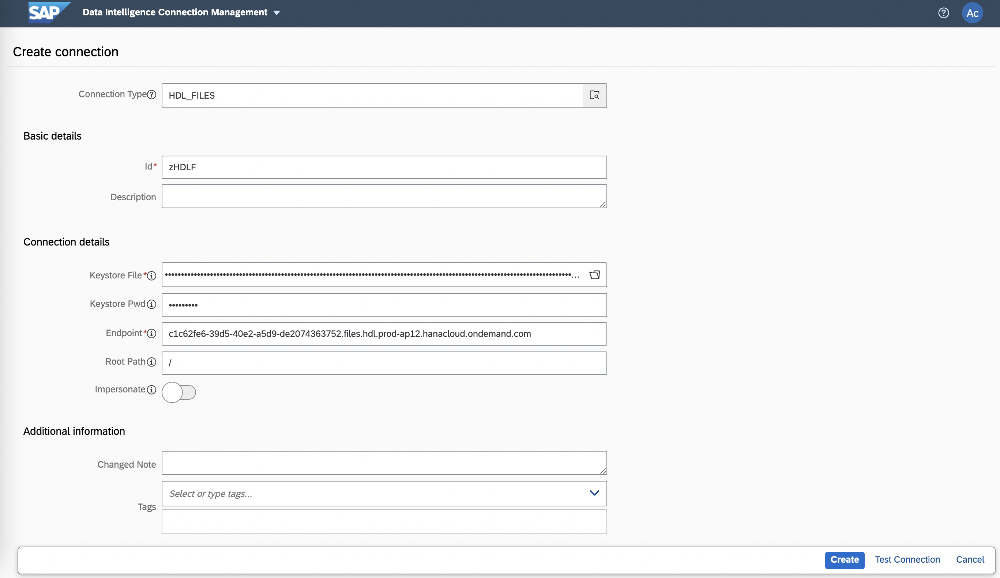
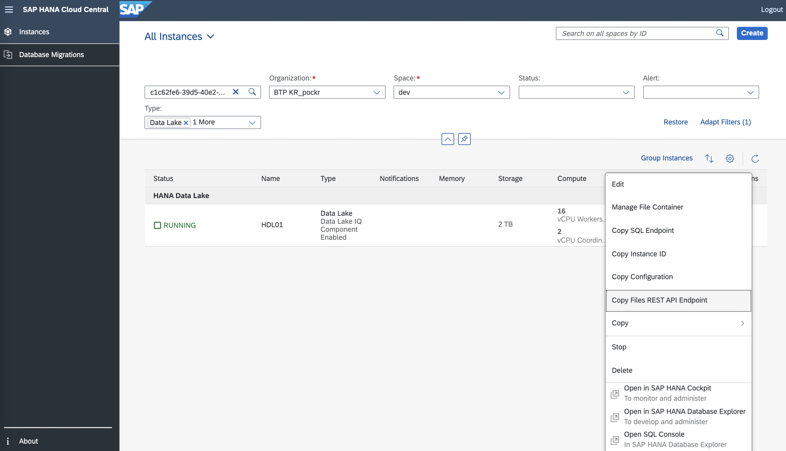
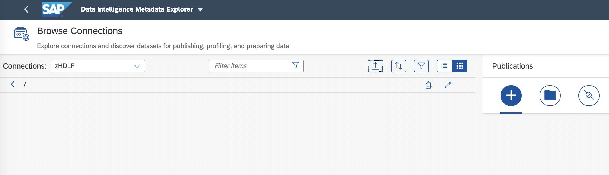
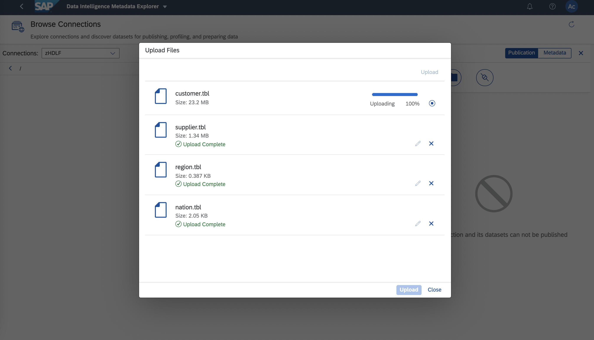

# HANA Cloud, Data Lake Files 액세스

## 1. How to create certificate for HANA Data Lake File Container

    /home/user/hdl_files % openssl genrsa -out ca.key 2048
    Generating RSA private key, 2048 bit long modulus (2 primes)
    ....................+++++
    .....................................................+++++
    e is 65537 (0x010001)
    
    
    /home/user/hdl_files % openssl req -x509 -new -key ca.key -days 200 -out ca.crt
    You are about to be asked to enter information that will be incorporated
    into your certificate request.
    What you are about to enter is what is called a Distinguished Name or a DN.
    There are quite a few fields but you can leave some blank
    For some fields there will be a default value,
    If you enter '.', the field will be left blank.
    -----
    Country Name (2 letter code) [AU]:KR
    State or Province Name (full name) [Some-State]:Seoul
    Locality Name (eg, city) []:
    Organization Name (eg, company) [Internet Widgits Pty Ltd]:
    Organizational Unit Name (eg, section) []:
    Common Name (e.g. server FQDN or YOUR name) []:ca
    Email Address []:
    
    
    /home/user/hdl_files % openssl req -new -nodes -newkey rsa:2048 -out client.csr -keyout client.key
    Generating a RSA private key
    ...............+++++
    .....................................................................+++++
    writing new private key to 'client.key'
    -----
    You are about to be asked to enter information that will be incorporated
    into your certificate request.
    What you are about to enter is what is called a Distinguished Name or a DN.
    There are quite a few fields but you can leave some blank
    For some fields there will be a default value,
    If you enter '.', the field will be left blank.
    -----
    Country Name (2 letter code) [AU]:KR
    State or Province Name (full name) [Some-State]:Seoul
    Locality Name (eg, city) []:
    Organization Name (eg, company) [Internet Widgits Pty Ltd]:
    Organizational Unit Name (eg, section) []:
    Common Name (e.g. server FQDN or YOUR name) []:dokon
    Email Address []:

    Please enter the following 'extra' attributes
    to be sent with your certificate request
    A challenge password []:
    An optional company name []:
    
    
    /home/user/hdl_files % openssl x509 -days 100 -req -in client.csr -CA ca.crt -CAkey ca.key -CAcreateserial -out client.crt
    Signature ok
    subject=C = KR, ST = Seoul, O = Internet Widgits Pty Ltd, CN = dokon
    Getting CA Private Key
    
    
    /home/user/hdl_files % openssl verify -CAfile ca.crt client.crt
    client.crt: OK
    
    # 암호 - Data Intelligence에서 HANA Cloud, Data Lake로 연결할 때 사용합니다.
    /home/user/hdl_files % openssl pkcs12 -export -out client.p12 -in client.crt -inkey client.key
    Enter Export Password:
    Verifying - Enter Export Password:
    
    
    /home/user/hdl_files % ls -l
    total 56
    -rw-r--r--  1 i063382  staff  1269 Oct  1 02:05 ca.crt
    -rw-------  1 i063382  staff  1679 Oct  1 02:05 ca.key
    -rw-r--r--  1 i063382  staff    41 Oct  1 02:06 ca.srl
    -rw-r--r--  1 i063382  staff  1151 Oct  1 02:06 client.crt
    -rw-r--r--  1 i063382  staff   972 Oct  1 02:06 client.csr
    -rw-------  1 i063382  staff  1704 Oct  1 02:05 client.key
    -rw-------  1 i063382  staff  2413 Oct  1 02:32 client.p12

    # 확장자(.p12) 파일은 Data Intelligence에서 HANA Cloud, Data Lake Files로 연결할 때 사용합니다.
    
    curl --insecure -H "x-sap-filecontainer: c1c62fe6-39d5-40e2-a5d9-de2074363752" --cert ./client.crt \
    --key ./client.key "https://c1c62fe6-39d5-40e2-a5d9-de2074363752.files.hdl.prod-ap12.hanacloud.ondemand.com/webhdfs/v1/?op=LISTSTATUS" -X GET

    curl --insecure -H "x-sap-filecontainer: c1c62fe6-39d5-40e2-a5d9-de2074363752" --cert ./client.crt \
    --key ./client.key "https://c1c62fe6-39d5-40e2-a5d9-de2074363752.files.hdl.prod-ap12.hanacloud.ondemand.com/webhdfs/v1/?op=WHOAMI" -X GET

    curl --insecure -H "x-sap-filecontainer: c1c62fe6-39d5-40e2-a5d9-de2074363752" --cert ./client.crt \
    --key ./client.key "https://c1c62fe6-39d5-40e2-a5d9-de2074363752.files.hdl.prod-ap12.hanacloud.ondemand.com/webhdfs/v1/?op=LISTSTATUS_RECURSIVE" -X GET

## 2. Connect into HANA Cloud, Data Lake Files in Connection Manangement in Data Intelligence

 

 

 

 
