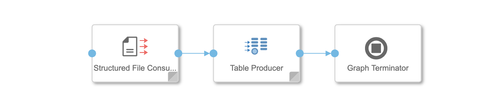
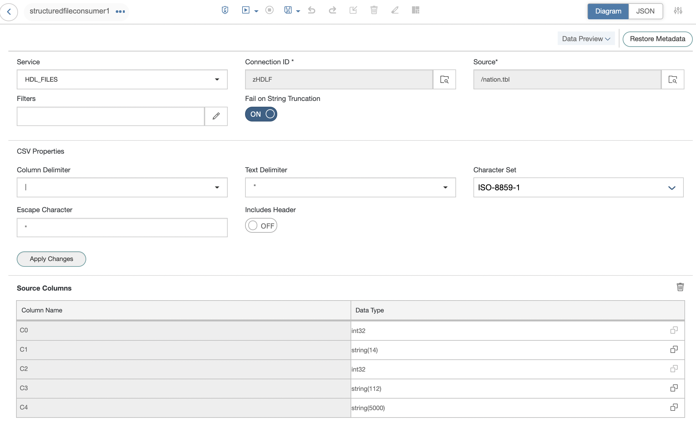
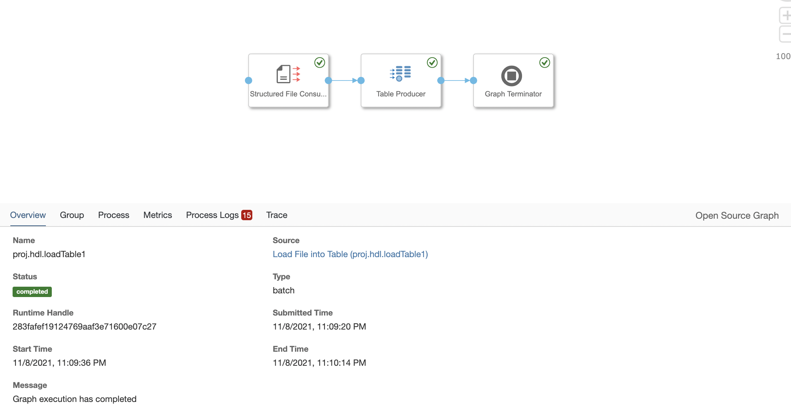

# Data Intelligence Pipeline에서 Data Lake IQ Table 데이터 적재

## 1. Data Lake IQ - 옵션 설정 및 테이블 생성

SAP HANA Database Explorer에서 SQL 스크립트를 작성합니다. 

    -- Load File into Table using DI Pipeline
    create table USER1.NATION_DI (
       N_NATIONKEY          integer                        not null iq unique (25),
       N_NAME               varchar(25)                       not null,
       N_REGIONKEY          integer                        not null iq unique (5),
       N_COMMENT            varchar(152)                   not null,
       constraint PK_NATION primary key (N_NATIONKEY)
    );
    
    -- 원격(remote)에서 Data Lake IQ 테이블로 적재할 때
    set option PUBLIC.ALLOW_READ_CLIENT_FILE = 'ON';

## 2. DI Pipeline 데이터 적재

Data Intelligence -> Modeler에서 Data Lake 관련 Pipeline를 작성합니다. 

### 2.1 DI Pipeline

 

### 2.2 Structured File Consumer Operator 설정

 

### 2.3 Table Producer Operator 설정

 

### 2.4 DI Pipeline 실행 

 

